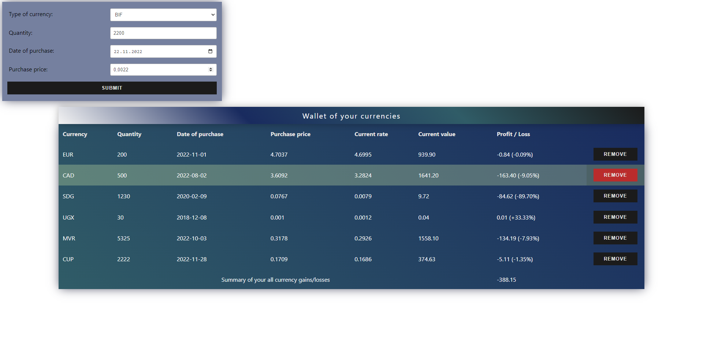
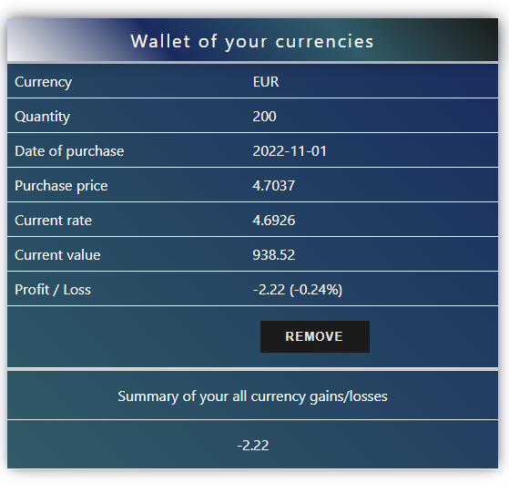

# Currency Wallet

See the live version of [Currency Wallet](https://devmentor.pl).

Our app allows you to store data about currencies you have recently bought, moreover, it has many automated processes, such as:
- Profit/Loss calculation,
- Currency exchange rate update,
- Suggesting purchase price based on the selected purchase date,
- Recording of data each time change is made to the wallet.

Thanks to the above solutions, calculations will be carried out precisely and with verified and up-to-date data.

So as a user you don't have to worry about many things and you can just:
- Add Currency,
- Delete Currency,

knowing that all your data is saved, even if you close an app.

&nbsp;
 
## 💡 Technologies


&nbsp;
 
## 🔗 See also

Are you interested in **React** and **Redux**? See my other project -> [Meeting Calendar](https://github.com/MateuszSuplewski/task-react-redux-basics).

&nbsp;
 
## 💿 Installation & Run

The project uses [node](https://nodejs.org/en/) and [npm](https://www.npmjs.com/). Having them installed, type into the terminal: `npm i`.

Currencies data is provided via API. You have to generate key from to get access to [exchangeAPI](https://exchangeratesapi.io/).

To connect application with the key:
- Copy key into `YOUR_KEY` in `.env-example` file
- Rename `.env-example` into `.env`

Your app is now ready to start - Use terminal and type: `npm start`

Currency Wallet should be running on [`http://localhost:3000`](http://localhost:3000)


&nbsp;
 
## 🤔 Solutions provided in the project

- ### Data presentation on mobile phones | Mobile design

Most table-based applications do not provide separate development for mobile devices.
The solution used here, however, is a separate style and looks great: ([Inspiration](https://css-tricks.com/responsive-data-tables/))
```css
  @media screen and (max-width: 825px) {
    display: block;
    border-bottom: 1px solid #eee;
    position: relative;
    padding: 0.5rem 0.5rem 0.5rem 50%;

    &:before {
      position: absolute;
      top: 0.5rem;
      left: 0.5rem;
      width: 50%;
      padding-right: 1rem;
      white-space: nowrap;
      content: '${({ colName }) => colName}';
    }
  }
``` 

<p align="center">
  
</p>


 &nbsp;

- ### Data storage

Using `localStorage` to save currencies data


```javascript
const LOCAL_STORAGE_KEY = 'CurrencyWallet'
const preloadedState = JSON.parse(localStorage.getItem(LOCAL_STORAGE_KEY)) || undefined
// ...
localStorage.setItem(LOCAL_STORAGE_KEY, JSON.stringify(state))

```
 &nbsp;

- ### Setting up application state with Redux, Redux Thunk

 Redux stores state of the application and allows you to easily transfer data between components in app without need to use hooks such as: `useState`, `useReducer` or `useContext`.

 Thanks to Redux Thunk, it also allows us to work with asynchronous code (like getting currencies from the API), which makes it an uncompromising tool in large applications.

 ```javascript
 const rootReducer = combineReducers({
   wallet: walletReducer,
   getCurrencies: getCurrenciesReducer
 })

 const store = createStore(
   rootReducer,
   preloadedState,
   composeWithDevTools(
     applyMiddleware(thunk)
   )
 ) // Setting up Redux + Redux Thunk

 ```
 &nbsp;
 
- ### Styling with theme

Project uses a theme, you can give elements any colors by changing the values in the `theme.js` file, which makes it easy to customize the style of the table without having to rebuild the application.

 ```javascript
 const themeSettings = {
  actionColor: '#ba2c2c',
  errorColor: '#ba2c2c',
  formInputColor: 'rgba(0,0,0,0.7)',
  labelColor: 'black',
  buttonColor: '#1b1b1b',
  primaryCellColor: 'white',
  secondaryCellColor: '#e5e5e5',
  rowHoverColor: 'rgba(211, 238, 170, 0.3)',
  cellHoverColor: 'rgba(68, 90, 88, 0.5)',
  formBgColor: 'rgba(25, 43, 95, 0.6)'
}
 ```

 &nbsp;
 
- ### Reusable functions

As a good developer you should be able to create independent functions that can be passed to multiple projects which makes them reusable.
You can find many of them here in `helpers` folder.

Example of function that return only unique currencies:
```javascript
const getUniqueCurrencyTypesFromWallet = (currencies) => {
  return currencies.map(({ type }) => type)
    .filter((type, index, array) => array.indexOf(type) === index)
}
```

&nbsp;

## 💭 Application development plans

I would like to extend project functionality by:
- Charts for the most valuable currencies to show the user changes over time, which will increase the probability of a good investment,
- Scroll back to top and top to back buttons for easy navigation on mobile,
- Possibility of sorting by any value.


&nbsp;

## 🙋‍♂️ Feel free to contact me
In case you found any/more issues that could've been solved, you have ideas how we can create something more complex or just simply want to chat, then just let me know on:
[Linkedin](https://www.linkedin.com/in/mateusz-suplewski-705017227/) or via Email : Matx3582@gmail.com
&nbsp;

## 👏 Credits
Thanks to my [Mentor - devmentor.pl](https://devmentor.pl/) & [Akademia Samouka](https://akademiasamouka.pl/) - for providing me with this task.


&nbsp;